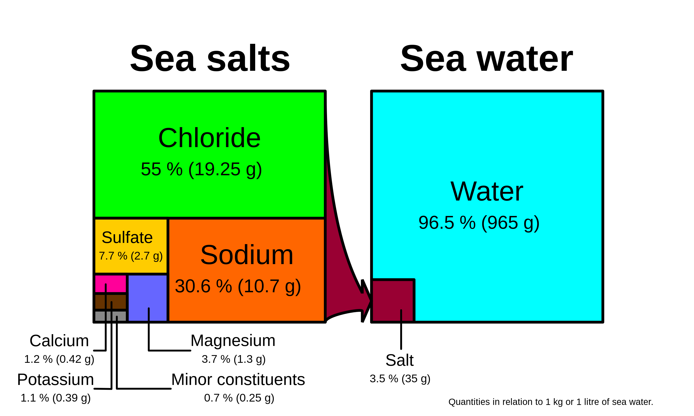

+++
title = "My First Post"
date = "2025-08-28T01:05:22+08:00"
draft = false
+++
English Article Edition.

Here is a picture:



Here is another picture:


## Bundle Solution

### "Bundling" Hugo Content and Images

The root of all our previous problems is that we tried to make two “worlds” (Typora's local file-system vs. Hugo's website) understand a **separated** structure—articles live in the `content` folder while images sit far away in the `static` folder.

From now on we’ll adopt the more modern pattern recommended by the Hugo team, called **Page Bundles**.

**Core idea:** Stop splitting articles and images apart. Instead, **put one article and every resource it needs into the same folder**. The article itself becomes a “resource bundle”.

**The benefits are game-changing:**

1.  **Ultra-simple paths:** Images and the article are now “neighbors”; the reference path becomes trivial.
2.  **One world, one rule:** This ultra-simple path is understood by Typora and by Hugo alike. **The collision between the two worlds vanishes instantly.**
3.  **Easy maintenance:** When you want to delete an article, you delete just one folder; all related images disappear with it—no orphaned “garbage files” are left behind.

---

### **The Ultimate Solution: Embrace Page Bundles**

#### **Step 1: Restructure Your Posts**

1.  **Create a bundle for the Chinese post:**
    *   Go to `E:\iyuxiaoyan\yxyweb\content\zh\posts\`.
    *   Create a **new folder** named `my-first-post`.
    *   Move the existing `my-first-post.md` **into** this new folder.
    *   Rename the file to `index.md`. (`index.md` is the flag Hugo uses to recognize a bundle.)

2.  **Create a bundle for the English post:**
    *   Go to `E:\iyuxiaoyan\yxyweb\content\en\posts\`.
    *   Likewise, create a **new folder** named `my-first-post`.
    *   Move `my-first-post.md` **into** it and rename it to `index.md`.

#### **Step 2: Move the Images into the Bundles**

1.  Go to the folder where we previously kept the images:  
    `E:\iyuxiaoyan\yxyweb\static\images\posts\my-first-post\`.
2.  Copy (or cut) the two images inside—`sea-salt-element.png` and `your-life-today.jpg`—into **both** new locations:
    *   `E:\iyuxiaoyan\yxyweb\content\zh\posts\my-first-post\`
    *   `E:\iyuxiaoyan\yxyweb\content\en\posts\my-first-post\`

**When you’re done, the new structure will look like this:**

```
content/
└── zh/
    └── posts/
        └── my-first-post/  <-- this is a bundle
            ├── index.md        <-- the post
            ├── sea-salt-element.png <--- image neighbor
            └── your-life-today.jpg  <--- image neighbor
```

#### **Step 3: Use the Simplest “Universal Language”**

Because images and article are now neighbors, we can reference them with the simplest **relative path**.

**Action items:**

1.  **Edit the Chinese post** (`zh/posts/my-first-post/index.md`)

    *   Replace its contents with:

    ```toml
    +++
    title = "我的第一篇文章"
    date = "2025-08-28T01:05:22+08:00"
    draft = false
    +++
    
    这里是中文版的第一篇文章。
    
    下面是插入示例：
    
    
    
    
    ```

2.  **Edit the English post** (`en/posts/my-first-post/index.md`)
    *   Make the same change, referencing the **same-named** image files.

---

### **Final, Decisive Acceptance Test**

After you’ve completed all the restructuring and content changes above:

1.  **Open Typora:**
    *   Directly open `.../my-first-post/index.md`. **The images render perfectly!** The simple relative path `` is the language Typora understands best.

2.  **Start the Hugo server:**
    *   Run `hugo server -D`.
    *   Visit `http://localhost:1313/` and open the post. **The images also render perfectly on the website!** Page Bundles have taken care of everything automatically.


## Log

- 250828 xiaoyan Created.