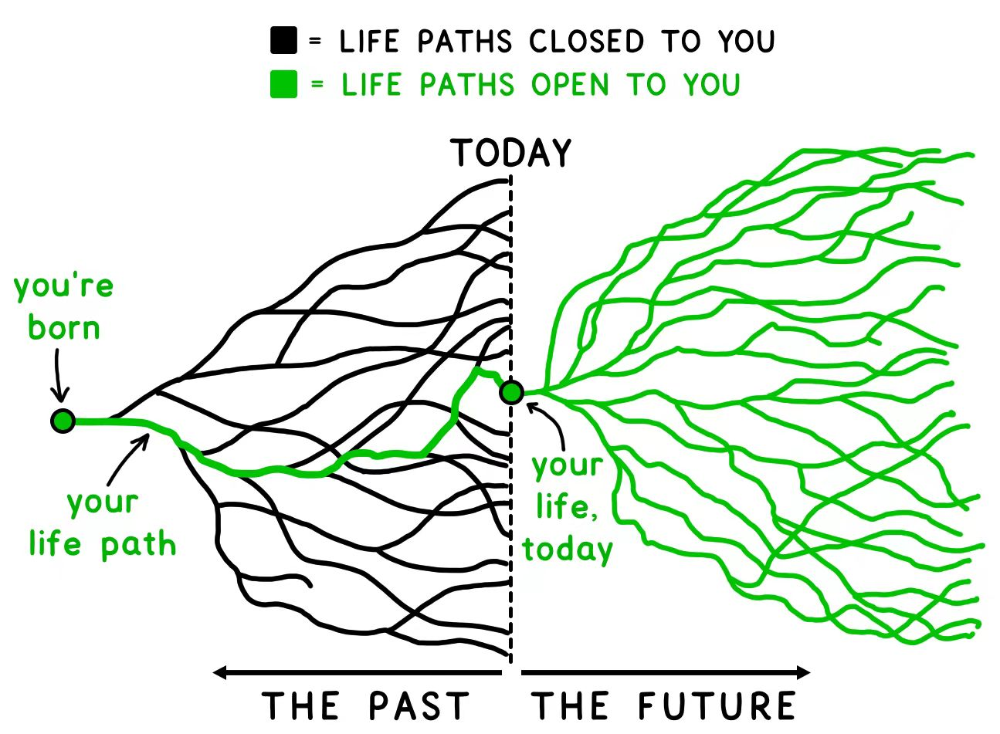

+++
title = "我的第一篇文章"
date = "2025-08-28T01:05:22+08:00"
draft = false

+++
这里是中文版的第一篇文章。

下面是插入示例：





## 捆绑解决方案

### Hugo内容与图片的“捆绑”

我们之前所有问题的根源，在于我们试图让两个“世界”（Typora的本地文件系统 vs Hugo的网站）去理解一个**分离**的结构——文章在 `content` 文件夹，而图片远在 `static` 文件夹。

现在，我们将采用Hugo官方更推荐的一种现代模式，叫做 **Page Bundles (页面捆绑包)**。

**核心理念：** 不再将文章和图片分开放。而是**把一篇文章和它所需要的所有图片，都放在同一个文件夹里**。这篇文章本身，就是一个“资源包”。

**这样做的好处是颠覆性的：**
1.  **路径极简：** 图片和文章成了“邻居”，引用路径变得极其简单。
2.  **世界统一：** 这个极简的路径，Typora能看懂，Hugo也能看懂。**两个世界的冲突，瞬间消失。**
3.  **管理方便：** 当您想删除一篇文章时，只需删除一个文件夹，所有相关的图片也就一并删除了，绝不会留下任何孤立的“垃圾文件”。

---

### **终极解决方案：拥抱Page Bundles**

#### **第一步：重构您的文章结构**

1.  **为中文文章创建“捆绑包”：**
    *   请进入 `E:\iyuxiaoyan\yxyweb\content\zh\posts\` 文件夹。
    *   在这里，创建一个**新的文件夹**，命名为 `my-first-post`。
    *   将现有的 `my-first-post.md` 文件，**移动到**这个新文件夹里。
    *   将这个文件**重命名**为 `index.md`。（`index.md`是Hugo识别捆绑包的标志）

2.  **为英文文章创建“捆绑包”：**
    *   请进入 `E:\iyuxiaoyan\yxyweb\content\en\posts\` 文件夹。
    *   同样，创建一个**新的文件夹**，命名为 `my-first-post`。
    *   将 `my-first-post.md` **移入**并**重命名**为 `index.md`。

#### **第二步：将图片移动到“捆绑包”内**

1.  请进入我们之前存放图片的 `E:\iyuxiaoyan\yxyweb\static\images\posts\my-first-post\` 文件夹。
2.  将里面的 `sea-salt-element.png` 和 `your-life-today.jpg` 这两张图片，**复制**（或剪切）到我们刚刚创建的**两个**新位置：
    *   `E:\iyuxiaoyan\yxyweb\content\zh\posts\my-first-post\`
    *   `E:\iyuxiaoyan\yxyweb\content\en\posts\my-first-post\`

**操作完成后，您的新结构将是这样的：**
```
content/
└── zh/
    └── posts/
        └── my-first-post/  <-- 这是一个捆绑包
            ├── index.md        <-- 文章内容
            ├── sea-salt-element.png <--- 图片邻居
            └── your-life-today.jpg  <--- 图片邻居
```

#### **第三步：使用最简单的“通用语”**

现在，因为图片和文章成了“邻居”，我们可以使用最简单的**相对路径**来引用它们了。

**操作指令：**
1.  **修改中文文章** (`zh/posts/my-first-post/index.md`)
    *   将其内容修改为：
    ```toml
    +++
    title = "我的第一篇文章"
    date = "2025-08-28T01:05:22+08:00"
    draft = false
    +++
    
    这里是中文版的第一篇文章。
    
    下面是插入示例：
    
    
    
    
    ```2.  **修改英文文章** (`en/posts/my-first-post/index.md`)
    *   做同样的修改，引用**同名**的图片文件。

---

### **最终的、决定性的验收**

当完成以上所有结构调整和内容修改后：

1.  **打开Typora：**
    *   直接打开 `.../my-first-post/index.md` 文件。**图片完美地显示出来了！** 因为 `` 这种简单的相对路径，是Typora最容易理解的语言。

2.  **启动Hugo服务器：**
    *   运行 `hugo server -D`。
    *   打开 `http://localhost:1313/` 并访问这篇文章。**网站上的图片也完美地显示出来了！** 因为Hugo的Page Bundle功能，已经自动处理好了一切。


## Log

250828，图片采用了相对引用法。

